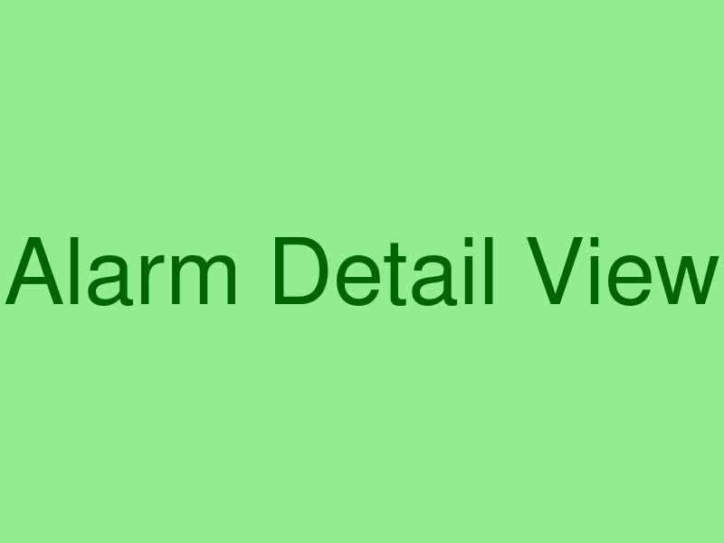
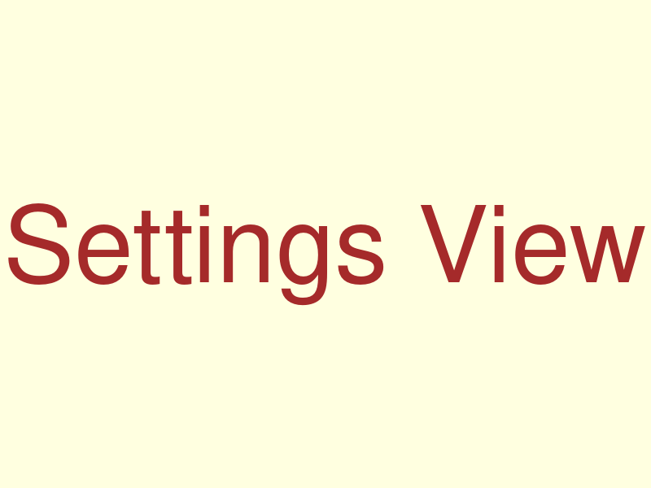

# Home Assistant Smart Alarm Clock - README

[](https://www.docker.com/)
[](https://www.python.org/)
[](https://streamlit.io/)
[](https://www.home-assistant.io/)

A modular application for managing multiple alarms with Home Assistant integration and a user-friendly Streamlit UI.

## Features

- **Multiple Alarms**: Create and manage multiple alarms for any day of the week
- **Streamlit UI**: User-friendly web interface for managing alarms
- **Flexible Scheduling**: Set alarms for specific days or day patterns (weekdays, weekends)
- **Volume Ramping**: Gradually increase volume for gentle wake-up
- **Presence Detection**: Skip alarms when you're not home
- **Morning Briefing**: Get weather and calendar information after your alarm
- **Snooze Functionality**: Snooze active alarms as needed
- **Persistent Storage**: All alarms are stored in a database for reliability

## Screenshots





## Quick Start

### Docker Installation (Recommended)

1. Clone the repository:
   ```bash
   git clone https://github.com/bmj2728/ha-alarm-clock.git
   cd ha-alarm-clock
   ```

2. Configure the application by creating a `config/config.yaml` file:
   ```yaml
   ha_url: http://your-home-assistant-url:8123
   ha_token: your_long_lived_access_token
   voice_pe_entity: media_player.your_media_player
   person_entity: person.your_name
   home_zone: zone.home
   ```

3. Start the application using Docker Compose:
   ```bash
   docker-compose up -d
   ```

4. Access the UI at `http://your-server-ip:8501`

## Documentation

- [User Guide](docs/user_guide.md): Installation, usage, and troubleshooting
- [Developer Guide](docs/developer_guide.md): Architecture, components, and extension
- [Enhancement Summary](docs/enhancement_summary.md): Summary of enhancements made

## Requirements

- Python 3.10+
- Home Assistant instance
- Media player entity in Home Assistant
- (Optional) Docker and Docker Compose

## License

This project is licensed under the MIT License - see the LICENSE file for details.

## Acknowledgments

- [Home Assistant](https://www.home-assistant.io/) for the amazing home automation platform
- [Streamlit](https://streamlit.io/) for the simple yet powerful UI framework
- [SQLAlchemy](https://www.sqlalchemy.org/) for the ORM
- [Schedule](https://schedule.readthedocs.io/) for the job scheduling
